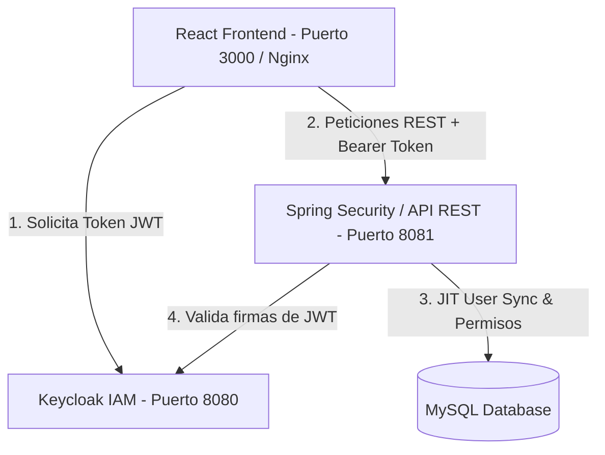
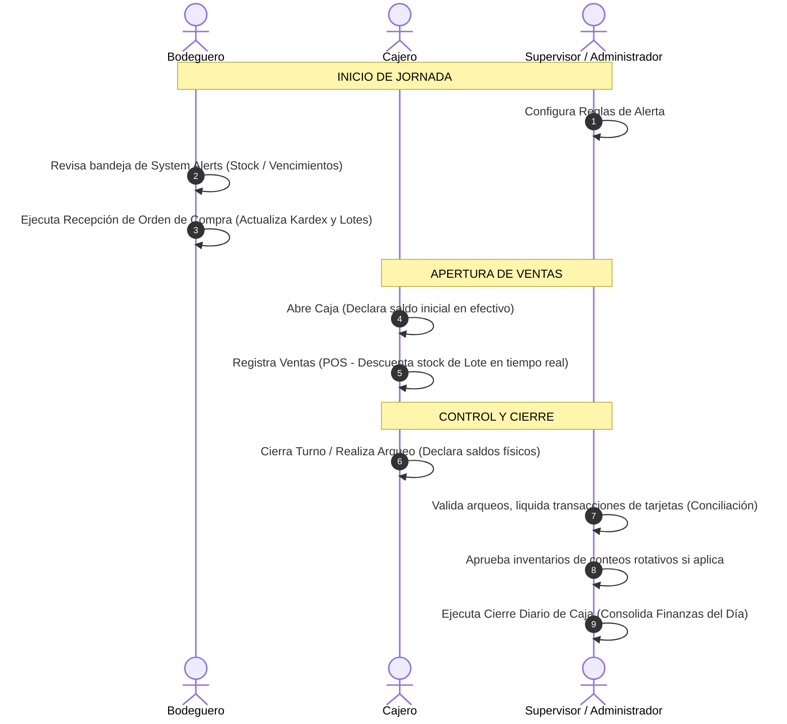

# GUÍA DE ESTUDIO Y DOCUMENTACIÓN TÉCNICA PARA LA DEFENSA DE EXAMEN DE GRADO
## Sistema de Punto de Venta (POS) y Gestión Integral de Supermercado

Este documento ha sido diseñado específicamente como material de estudio para la defensa de examen de grado. Contiene un desglose riguroso del sistema en sus ámbitos arquitectónico, funcional y de seguridad, así como una sección estratégica con posibles preguntas del jurado y sus respectivas respuestas recomendadas.

---

## 1. FICHA TÉCNICA DEL PROYECTO

*   **Nombre del Sistema:** Sistema de Punto de Venta y Gestión de Supermercado.
*   **Arquitectura General:** Arquitectura desacoplada basada en microservicios/APIs (Backend RESTful en Spring Boot + Frontend Single Page Application en React + Proveedor de Identidad Centralizado en Keycloak).
*   **Modelo de Seguridad:** Autenticación Federada mediante OpenID Connect (OIDC) y OAuth2 con flujo PKCE (S256), y Control de Acceso Basado en Roles y Permisos (RBAC/ABAC).
*   **Persistencia y Base de Datos:** Base de Datos Relacional (MySQL) con Control de Versiones del Esquema mediante migraciones automatizadas (Flyway).
*   **Despliegue y Virtualización:** Contenedores aislados (Docker y Docker Compose) con Servidor Proxy Inverso (Nginx).

---

## 2. ARQUITECTURA TECNOLÓGICA (TECH STACK)

El sistema se estructura en tres capas principales que garantizan desacoplamiento, alta disponibilidad y escalabilidad.

### A. Capa Cliente (Frontend)
*   **Tecnología Base:** React.js 19 (Librería de renderizado reactivo y orientado a componentes) + Vite.js (Herramienta de construcción y bundling ultrarrápida).
*   **Estilos y Diseño Visual:** Tailwind CSS (Framework CSS de utilidad que permite un diseño fluido y responsive) + Framer Motion (Librería para animaciones fluidas y transiciones de interfaz).
*   **Gráficos y Dashboards:** Chart.js con la integración `react-chartjs-2` para visualizaciones de métricas comerciales y financieras.
*   **Navegación:** `react-router-dom` para el enrutamiento dinámico en el cliente (Single Page Application).
*   **Pruebas (Testing):** Playwright para pruebas E2E (End-to-End) y Vitest para pruebas unitarias de lógica y componentes.

### B. Capa de Gestión de Identidad y Accesos (IAM)
*   **Keycloak v26:** Servidor open-source de Identity and Access Management (IAM). 
*   **Protocolo:** Implementación de OpenID Connect (OIDC) sobre OAuth2, con soporte para el flujo seguro de Autorización con Clave de Prueba para Intercambio de Código (PKCE S256).
*   **Características Clave:** Autenticación centralizada (Single Sign-On - SSO), administración de políticas de contraseñas de alta seguridad, tokens JWT firmados digitalmente.

### C. Capa Servidor (Backend API)
*   **Tecnología Base:** Java 17 + Spring Boot 3.5.
*   **Persistencia:** Spring Data JPA + Hibernate para el Mapeo Objeto-Relacional (ORM).
*   **Seguridad Interna:** Spring Security 6 configurado como OAuth2 Resource Server para validar de manera stateless los tokens JWT emitidos por Keycloak.
*   **Validación de Datos:** Spring Validation para asegurar la integridad de las peticiones mediante anotaciones en DTOs (`@NotNull`, `@Size`, `@Min`, etc.).
*   **Documentación de API:** Springdoc OpenAPI / Swagger UI para la generación de documentación interactiva y pruebas de endpoints.
*   **Generación de Reportes:** Apache POI (poi-ooxml) para la exportación y renderizado directo de archivos de hoja de cálculo de Excel (.xlsx).

### D. Capa de Base de Datos y Persistencia
*   **Motor de BD:** MySQL 8 (Motor transaccional relacional robusto).
*   **Evolución del Esquema:** Flyway DB. Controla las versiones del esquema de base de datos a través de scripts SQL incrementales (`db/migration/V1__...` a `V35__...`), garantizando que la base de datos se pueda recrear de forma idéntica en entornos de desarrollo, pruebas y producción.

---

## 3. ARQUITECTURA DE SOFTWARE Y PATRONES DE DISEÑO

### A. Modularización por Funcionalidades (Feature-first Packaging)
A diferencia de los diseños monolíticos tradicionales organizados estrictamente por capas globales, el backend está estructurado en paquetes basados en **funcionalidades/módulos** (ej. `product`, `sale`, `audit`, `alerts`, `cashregister`). 
Dentro de cada módulo se encuentra la estructura clásica en capas:
1.  **Controller:** Expone la interfaz REST (`@RestController`).
2.  **DTO (Data Transfer Object):** Desacopla la capa de entrada/salida de la entidad interna.
3.  **Service:** Contiene las reglas del negocio (`@Service` y `@Transactional`).
4.  **Repository:** Interfaz que extiende de `JpaRepository` para el acceso a la base de datos.
5.  **Entity:** Objeto anotado con JPA (`@Entity`) que representa la tabla relacional.
6.  **Mapper:** Encargado de la transformación bidireccional entre Entidades y DTOs.

> **Justificación académica ante el jurado:** *Esta estructura mejora el Principio de Responsabilidad Única (SRP) y la Alta Cohesión, disminuyendo el Acoplamiento. Si se requiere modificar el dominio de "Ventas", todos los archivos involucrados están agrupados en el paquete `sale`, facilitando el mantenimiento y permitiendo una futura migración a microservicios si el negocio escala.*

### B. Arquitectura de Eventos Internos (Event-Driven)
El sistema utiliza un patrón de publicador-suscriptor local apoyado por la infraestructura de eventos de Spring Framework (`ApplicationEventPublisher` y `@EventListener`).
*   **Aplicación:** Utilizado principalmente para el disparo automático y asíncrono de alertas del sistema (ej. detección de stock crítico, vencimiento de lotes o desviaciones financieras) sin bloquear las operaciones transaccionales principales del usuario.

### C. Auditoría y Trazabilidad Avanzada
El sistema implementa una tabla centralizada de auditoría (`audit_logs`) con una lógica de captura profunda:
*   **Estructura del Log:** Registra el usuario ejecutor, acción (CREATE, UPDATE, DELETE, SALE_CANCEL, etc.), tabla afectada, ID del registro y la dirección IP de origen de la transacción.
*   **Historial de Cambios (JSON Auditing):** Guarda en columnas tipo `TEXT` los estados anteriores (`old_values`) y nuevos (`new_values`) en formato JSON.
*   **Clasificación de Riesgo:** El servicio evalúa de forma dinámica si el log corresponde a una operación de alto riesgo (como eliminación de usuarios, anulación de facturas, cuadres de caja o modificaciones de saldo en inventario) para su marcado especial.

---

## 4. MÓDULOS Y FUNCIONALIDADES DEL SISTEMA

### Módulo 1: Autenticación, Seguridad y RBAC (Role-Based Access Control)
*   **Flujo Híbrido JIT (Just-In-Time) Sync:**
    1.  El usuario se autentica contra Keycloak.
    2.  Al recibir la petición REST con el token JWT en el backend, la clase [KeycloakJwtAuthenticationConverter](file:///02-BACKEND/supermarket-system-api/src/main/java/com/supermarket/security/KeycloakJwtAuthenticationConverter.java) valida el token.
    3.  Extrae los roles asignados en Keycloak (ej. `ROLE_CAJERO`, `ROLE_BODEGUERO`).
    4.  Sincroniza dinámicamente al usuario con la base de datos local (lo crea si no existe o actualiza sus datos si existían). Esto mantiene la consistencia relacional y permite asociar el usuario a transacciones locales de caja o auditoría.
    5.  Carga los permisos locales asignados a dicho rol en la base de datos y los asigna al contexto de Spring Security.
*   **Roles Definidos en el Sistema:**
    *   **ADMIN_INGENIERO:** Acceso total, incluyendo el módulo de mantenimiento de bajo nivel.
    *   **ADMINISTRADOR:** Gestión de inventarios, finanzas, control de caja, alertas, reportería y administración de usuarios.
    *   **SUPERVISOR:** Monitoreo operativo, arqueos de caja, visualización de inventarios, reportes y alertas.
    *   **BODEGUERO:** Gestión de lotes, conteo físico de inventario, recepción de órdenes de compra del proveedor.
    *   **CAJERO:** Operaciones exclusivas del Punto de Venta (POS) y arqueos parciales de su caja.
    *   **CONSULTOR:** Acceso en modo solo lectura para visualización de reportes e informes ejecutivos.

### Módulo 2: Punto de Venta (POS) y Facturación
*   **Registro de Venta (`SALE_CREATE`):** Permite a los cajeros procesar ventas de productos leyendo códigos de barra, seleccionando lotes específicos y aplicando unidades de medida.
*   **Pagos Múltiples:** Admite que una sola transacción sea pagada con múltiples medios de pago simultáneos (efectivo, tarjetas de crédito/débito, cupones de descuento).
*   **Facturación Electrónica:** Generación y verificación del estado de facturas electrónicas, asignación de numeración correlativa única controlada por el sistema y almacenamiento del estado fiscal de la venta.
*   **Cupones:** Creación de reglas de descuento mediante códigos promocionales de uso único o temporal.
*   **Control del Cambio:** Cálculo exacto del dinero a devolver al cliente, registrándolo en la transacción para cuadres de caja automáticos.

### Módulo 3: Finanzas, Notas de Crédito y Conciliación
*   **Devoluciones y Notas de Crédito:** Lógica transaccional para realizar devoluciones parciales o totales de una venta. El sistema genera una `CreditNote` que puede reintegrar dinero o generar saldo a favor del cliente.
*   **Cuentas de Pago y Liquidación:** Gestión de cuentas auxiliares (bancos, pasarelas de pago de tarjetas, efectivo en tránsito).
*   **Conciliación Bancaria:** Control financiero que permite marcar transacciones de tarjetas o transferencias como "liquidadas" tras comparar los reportes del banco/adquirente con los registros locales del sistema, detectando descuadres.

### Módulo 4: Control de Cajas y Cierres Diarios
*   **Ciclo de Vida de Caja:**
    1.  **Apertura de Caja (`CASH_OPEN`):** El cajero declara un saldo inicial en efectivo para iniciar operaciones. El sistema abre una sesión (`CashRegisterSession`).
    2.  **Transacciones:** Todas las ventas y devoluciones se asocian de forma obligatoria a esta sesión de caja.
    3.  **Movimientos de Caja (`CASH_MOVE`):** Registro de entradas o salidas manuales de efectivo (ej. retiro de efectivo por seguridad, o ingreso de cambio).
    4.  **Arqueo de Caja / Cierre Parcial:** El cajero cuenta el efectivo físico al final de su turno y declara los montos por método de pago. El sistema calcula las diferencias automáticamente.
    5.  **Cierre Diario Consolidado (`DailyClose`):** Proceso ejecutado por un Administrador o Supervisor que consolida todas las sesiones de caja del día, calcula los totales generales de ventas frente al efectivo esperado y cierra formalmente la jornada financiera del supermercado.

### Módulo 5: Gestión de Inventarios, Lotes y Kardex
*   **Control por Lotes e Historial de Vencimiento:** Los productos no se descuentan de forma genérica; se asocian a lotes específicos (`product_batches`), lo que permite controlar fechas de vencimiento precisas y evitar pérdidas de merma.
*   **Kardex Transaccional:** Registro histórico e inmutable de entradas, salidas y saldos de stock. Cada movimiento (venta, devolución, compra, merma, ajuste) genera un movimiento de Kardex asociado, permitiendo reconstruir el stock a cualquier fecha del pasado.
*   **Unidades de Medida (UoM) y Conversiones:** Soporte para unidades de medida múltiples (ej. comprar en cajas/bultos y vender en unidades sueltas o por peso). Las conversiones se calculan automáticamente con factores configurados.
*   **Conteo Físico e Inventarios Rotativos:**
    *   Creación de sesiones de conteo físico.
    *   Ingreso de conteos por el Bodeguero.
    *   Generación de reporte de variaciones (Diferencia Teórica vs. Real).
    *   **Aprobación de Ajustes (`INVENTORY_ADJUST`):** Requiere permiso de Supervisor o Administrador para aplicar los ajustes físicos y corregir el stock, emitiendo automáticamente la correspondiente alerta y log de auditoría.

### Módulo 6: Compras y Proveedores
*   **Gestión de Proveedores:** Base de datos de proveedores activos con sus correspondientes datos de contacto y condiciones comerciales.
*   **Órdenes de Compra:** Documento digital que detalla los productos solicitados al proveedor con sus respectivos costos unitarios negociados.
*   **Recepción Física de Mercancía (`PURCHASE_RECEIVE`):** Proceso mediante el cual el bodeguero confirma la recepción física en el almacén de los ítems de una orden de compra, generando en ese instante los lotes correspondientes y actualizando el Kardex de inventario.

### Módulo 7: Alertas y Reglas de Notificación
*   **Reglas de Notificación:** Configuración dinámica de umbrales (ej. alertar cuando el stock sea menor a X unidades, o cuando un lote esté a Y días de vencer).
*   **System Alerts:** Bandeja centralizada de alertas del sistema clasificadas por severidad (Información, Advertencia, Crítica). Permite su revisión e histórico de resoluciones.

---

## 5. ESTRUCTURA DE LA BASE DE DATOS (MIGRACIONES DE FLYWAY)

El diseño de base de datos relacional del sistema ha evolucionado a través de 35 migraciones controladas. A continuación se detallan las tablas y flujos relacionales críticos explicados en SQL:

1.  **Seguridad y RBAC:**
    *   `users`: ID, email, password, full_name, role_id, is_active, created_at, last_login.
    *   `roles`: ID, name (ADMINISTRADOR, CAJERO, BODEGUERO, etc.), description.
    *   `permissions`: ID, code (SALE_CREATE, USER_MANAGE, etc.), description.
    *   `role_permissions`: Relación de muchos a muchos que mapea qué permisos otorga cada rol.
    *   `refresh_tokens`: Tokens para mantener sesiones seguras stateless de JWT sin requerir ingresos repetitivos de usuario.
2.  **Operación del POS y Ventas:**
    *   `sales`: ID, invoice_number (clave única), customer_id, user_id (cajero), session_id (sesión de caja activa), status (PAID, CANCELLED, REFUNDED), subtotal, total_tax, total_amount, change_amount, sale_date.
    *   `sale_details`: ID, sale_id, product_id, batch_id (lote de procedencia del producto), quantity, unit_price, discount_amount, tax_amount, subtotal.
    *   `sale_payments`: ID, sale_id, payment_account_id, amount (efectivo, tarjeta, etc.).
    *   `coupons`: ID, code, discount_type, value, expiration_date, active.
3.  **Auditoría y Alertas:**
    *   `audit_logs`: ID, user_id, action, affected_table, record_id, old_values (TEXT/JSON), new_values (TEXT/JSON), ip_address, log_date.
    *   `system_alerts`: ID, alert_key, type, severity, status, title, message, source_module, reference_id, action_path, created_at, resolved_at, resolved_by_id.
    *   `notification_rules`: ID, code, title, message_template, severity, rule_type, conditions_json.
4.  **Control de Caja y Cierres:**
    *   `cash_register_sessions`: ID, user_id, status (OPEN, CLOSED), opened_at, closed_at, initial_balance, expected_balance, declared_balance, difference_amount.
    *   `cash_register_movements`: ID, session_id, type (IN, OUT), amount, description, created_at.
    *   `daily_closures`: ID, closure_date, total_sales, total_expected, total_declared, total_difference, closed_by_id, created_at.
5.  **Inventario y Almacén:**
    *   `products`: ID, code, name, description, category_id, base_uom_id, tax_category_id, min_stock, max_stock, is_active.
    *   `product_batches`: ID, product_id, batch_number, quantity, initial_quantity, expiration_date, created_at, is_expired.
    *   `inventory_kardex`: ID, product_id, batch_id, movement_type (INPUT, OUTPUT), source_type (SALE, PURCHASE, ADJUSTMENT, RETURN), source_id (ID de la transacción origen), quantity, unit_cost, total_cost, balance_quantity, balance_cost.
    *   `inventory_counts`: ID, status (DRAFT, IN_PROGRESS, COMPLETED, ADJUSTED), created_at, approved_at, approved_by_id.
    *   `inventory_count_lines`: ID, count_id, product_id, batch_id, uom_id, system_quantity, counted_quantity, difference_quantity.
    *   `uom` y `uom_conversions`: Definición de unidades de medida (Kilogramo, Litro, Caja) y sus factores de equivalencia matemática.

---

## 6. PREGUNTAS FRECUENTES DEL JURADO Y CÓMO RESPONDERLAS

### Pregunta 1: ¿Por qué decidieron utilizar Keycloak en lugar de programar la autenticación tradicional en el Backend?
*   **Respuesta Recomendada:** *"Decidimos implementar un Proveedor de Identidad (IdP) especializado como Keycloak por tres razones fundamentales de ingeniería de software:*
    *   *1. **Seguridad y Cumplimiento:** Keycloak implementa de forma nativa estándares de la industria como OAuth2 y OpenID Connect con flujos seguros (como PKCE S256). Delegar la autenticación a un IAM especializado mitiga riesgos asociados al almacenamiento directo de contraseñas y al manejo manual de tokens JWT.*
    *   *2. **Arquitectura Escalable:** Keycloak funciona de manera independiente. Si en el futuro incorporamos otras aplicaciones (ej. un portal de proveedores, aplicación móvil para clientes o sistema de recursos humanos), podemos usar el mismo Keycloak para proveer Single Sign-On (SSO) centralizado.*
    *   *3. **Desacoplamiento:** El backend no se sobrecarga con flujos de registro, bloqueo de cuentas por intentos fallidos, o flujos de cambio de contraseña, permitiéndole enfocarse 100% en las reglas de negocio del supermercado."*

### Pregunta 2: ¿Cómo manejan la consistencia en el Inventario si dos cajeros venden el mismo producto en el mismo instante (Concurrencia)?
*   **Respuesta Recomendada:** *"La concurrencia en la base de datos se maneja a dos niveles:*
    *   *1. **Transaccionalidad ACID:** Las operaciones de venta e inventario están protegidas bajo anotaciones `@Transactional` en Spring Boot. Si una transacción falla a mitad del proceso (por ejemplo, por falta de stock), se ejecuta un rollback completo garantizando que no queden datos parciales.*
    *   *2. **Mapeo por Lotes y Control de Stock:** El sistema descuenta stock de lotes específicos (`product_batches`). A nivel de base de datos se implementa un mecanismo de bloqueo en las consultas de actualización. Además, antes de procesar el pago, el backend valida en tiempo real que la cantidad solicitada en el lote siga estando disponible. En caso de que otra transacción paralela haya agotado el stock del lote milisegundos antes, el sistema rechaza la venta de forma controlada indicando que el stock ya no está disponible."*

### Pregunta 3: Explique cómo implementaron la auditoría en la base de datos y cómo garantizan que no sea alterada.
*   **Respuesta Recomendada:** *"La auditoría se implementó a nivel de capa de negocio mediante un servicio centralizado llamado `AuditLogService`. Cada vez que ocurre un evento crítico (creación, edición, eliminación o anulación), el servicio captura:*
    *   *El usuario autenticado a través del contexto de seguridad de Spring Security.*
    *   *La IP de origen del cliente extraída de los atributos de la petición HTTP.*
    *   *Los valores anteriores (`oldValues`) y nuevos (`newValues`) serializados en formato JSON.*
    *   *Para garantizar la inmutabilidad de la auditoría, la tabla `audit_logs` en base de datos está configurada con restricciones a nivel de capa de servicio (los endpoints REST solo permiten consultas `GET` de lectura, no hay endpoints para actualizar o borrar logs). Adicionalmente, ante el jurado, se puede proponer que en un entorno productivo real, el usuario de base de datos utilizado por la aplicación Spring Boot solo tenga permisos de `INSERT` y `SELECT` sobre la tabla de auditorías, impidiendo sentencias `UPDATE` o `DELETE` directamente desde el código."*

### Pregunta 4: ¿Qué es Flyway y qué valor aporta al proyecto?
*   **Respuesta Recomendada:** *"Flyway es una herramienta de migración de bases de datos. Aporta control de versiones al esquema de base de datos, resolviendo el clásico problema de 'en mi máquina funciona'. Cada cambio en el esquema (crear tablas, agregar columnas, insertar datos semilla) se escribe en un archivo SQL numerado. Al arrancar la aplicación, Flyway compara los scripts aplicados en la base de datos contra los scripts del código, ejecutando de forma ordenada únicamente las migraciones pendientes. Esto asegura que la base de datos de producción tenga exactamente la misma estructura que la de desarrollo de forma automatizada y auditable."*

### Pregunta 5: ¿Por qué estructuraron el backend por 'Funcionalidades' (Features) en lugar de capas tradicionales?
*   **Respuesta Recomendada:** *"La estructura orientada a funcionalidades o 'Feature-first packaging' agrupa todo el código relacionado con un dominio específico (controlador, servicio, repositorio, entidad, DTO) en una sola carpeta jerárquica. Esto aporta tres grandes ventajas operativas:*
    *   *1. **Alta Cohesión:** El código que cambia en conjunto se mantiene en conjunto. Si modificamos la lógica del módulo de alertas, solo abrimos el directorio `alerts`.*
    *   *2. **Menor Carga Cognitiva:** Facilita a nuevos desarrolladores comprender el sistema, ya que los módulos coinciden directamente con los módulos funcionales del negocio.*
    *   *3. **Camino hacia Microservicios:** Si el módulo de Punto de Venta (POS) demanda demasiados recursos, podemos extraer fácilmente la carpeta `sale` y convertirla en un microservicio independiente, ya que el acoplamiento con otras carpetas está claramente definido."*

### Pregunta 6: ¿Cómo funciona el proceso de Arqueo y Cierre Diario de Caja?
*   **Respuesta Recomendada:** *"El sistema implementa un control de tres pasos para prevenir fraudes y errores de caja:*
    *   *1. **Apertura Ciegas:** Al abrir caja, el cajero declara su monto inicial sin saber cuánto calcula el sistema que debería haber quedado del día anterior (o bien se valida contra la entrega).*
    *   *2. **Arqueo Ciego del Cajero:** Al terminar el turno, el cajero realiza un conteo físico de su caja y declara cuánto dinero tiene en efectivo, tarjetas, etc. El sistema calcula las ventas transadas asociadas a su `CashRegisterSession` y genera una diferencia (sobrante o faltante).*
    *   *3. **Cierre Diario Consolidado:** Un supervisor o administrador revisa los arqueos declarados de todas las sesiones activas y ejecuta el cierre del día (`DailyClose`), el cual bloquea las sesiones de caja impidiendo que se les asocie más ventas, consolidando la contabilidad diaria."*

---

## 7. CRONOGRAMA DE OPERACIONES FINANCIERAS Y DE INVENTARIO (RESUMEN OPERATIVO)

Para complementar la exposición, este diagrama describe el flujo diario de la operación del supermercado:

